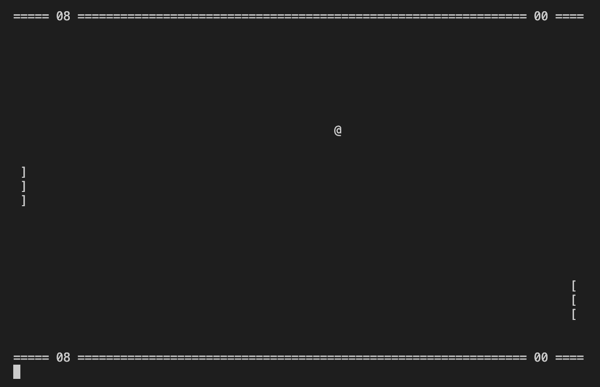

# Игра Ping-pong.
Управление осуществляется клавишами [a][z] для левой и [k][m] для правой ракетки.

Выход из программы клавиша [e]

#### Для запуска файла, скомпилируйте его. 

Можно использовать команду [Make] для автоматической компиляции и запуска.

